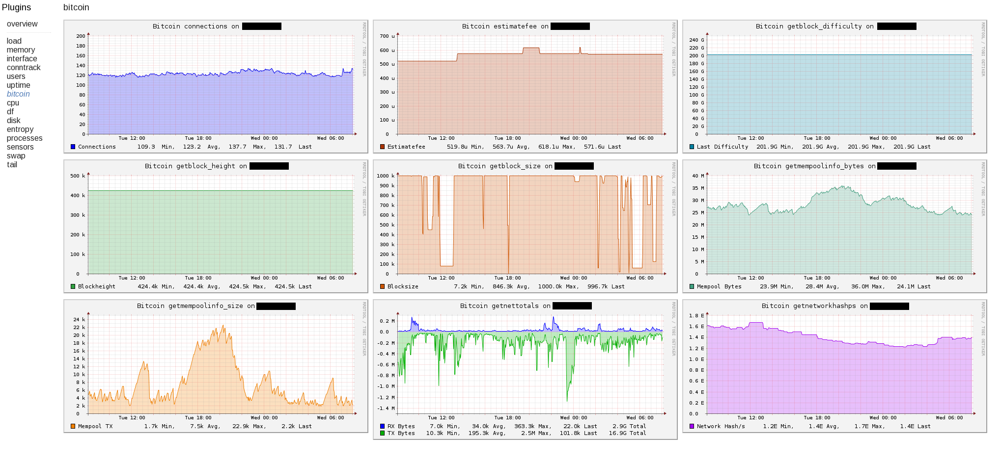

collectd-bitcoin.py
======
Python plugin for collectd to query bitcoind via rpc.

This is based on a python script from C-Otto found at:
https://gist.github.com/C-Otto/a9e4864dff1a2b167761

This is also based on a python script by nomnombtc:
https://github.com/nomnombtc/collectd-bitcoin 

Mostly changes to make the query code work within the collectd
plugin environment. 

Together with something like [CGP](https://github.com/pommi/CGP) it can generate nice graphs:

(Note if you use CGP, there is a custom plugin to control colors/naming scheme in [the CGP/ subfolder](CGP/).)

Usage
======

Needs a running bitcoin-{core,classic,unlimited} daemon with rpc user/password set.

This is needed to connect via rpc: https://github.com/jgarzik/python-bitcoinrpc

Replace ```rpcuser``` and ```rpcpassword``` with your bitcoind rpc username/password in the script.

Enable collectd Python plugin:
```
LoadPlugin python
```

Put something like this into collectd.conf assuming that your plugins
live in `/opt/collectd_plugins`:
```
<Plugin python>
    ModulePath "/opt/collectd_plugins"
    Import "collectd-bitcoin-plugin"
</Plugin>
```

Other
=====
```example.py``` A simple script to read getblockhash from your bitcoind node and print the result to the console

```test.py```   A simple script that shows how to read bitcoind values and feed them to collectd

```example-ssl.py``` A simple script to query a remote bitcoind node that is available via SSL on port 443

Notes
=====
For ```example-ssl.py``` you will need to set the path to the self-signed ```pem``` file or the SSL connection
will fail:
```
export SSL_CERT_FILE=<path-to-pem-file>/server.pem
```
If you are using a self-signed ```pem``` for the reverse proxy on the bitcoin node, just copy that file to the
local directory and set the environment variable as shown above before running the example Python code.
